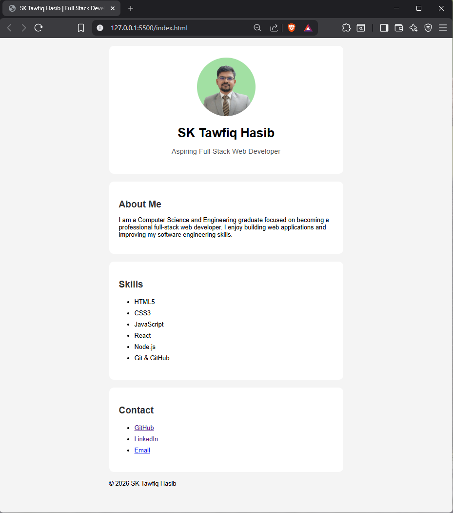

# Professional Profile Card

A responsive personal profile card built using HTML5 and CSS3.

This is my first project in my Full-Stack Web Development Bootcamp.

## 🚀 Features

- Semantic HTML structure
- Responsive layout
- Profile image section
- About section
- Skills section
- Contact links
- Mobile-friendly design

## 🛠 Technologies Used

- HTML5
- CSS3

## 📸 Screenshot



## 📂 Project Structure

```
professional-profile-card

├── index.html
├── style.css
├── README.md
└── assets
    └── profile-image.jpg
```

## 🎯 Learning Objectives

Through this project I practiced:

- Semantic HTML
- CSS selectors
- CSS cascade
- Box model
- Responsive design
- Git and GitHub workflow

## 🔮 Future Improvements

- Add animations
- Add dark mode
- Improve accessibility
- Add social media icons